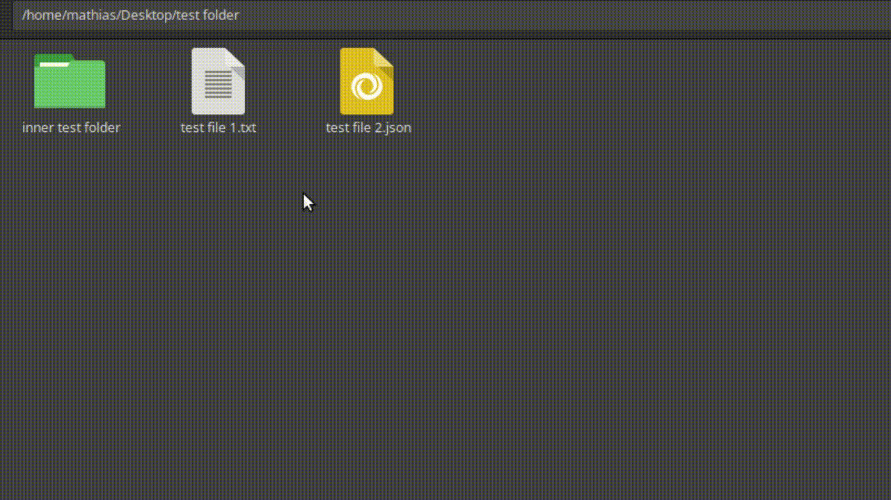

# VSCode context menu options for Nemo

Nemo, Cinnamon DE file manager, supports adding actions and scripts to it's context menu.

Just save the following files inside  `~/.local/share/nemo/actions/` to add "Open with VSCode" options to Nemo's context menu (they're inside `src` folder):
* **vscode_open_folder.nemo_action**: Open current folder in VSCode;
* **vscode_open_selected_folder.nemo_action**: Open selected folder in VSCode;
* **vscode_open_file.nemo_action**: Open selected file in VSCode (single file);
* **vscode_open_multiple_files.nemo_action**: Open selected files in VSCode (multiple file).

**Running example Gif:**

Take this as inspiration and create your own scripts and actions.

~~**PS**: There is a Nemo's bug, where, when you open a folder, the selection in previous folder "don't go away", and then you'll see an "open selected folder in VSCode" message when clicking on the folder's background. I'll already open an issue on Nemo's repository: https://github.com/linuxmint/nemo/issues/2167~~ (Fixed)
